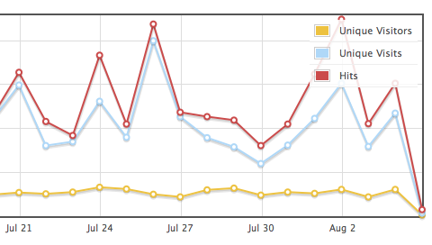

django-request
==============

django-request is a statistics module for django. It stores requests in a database for admins to see, it can also be used to get statistics on who is online etc.

As well as a site statistics module, with the `active_users` template tag and manager method you can also use django-request to show who is online in a certain time.

    Request.objects.active_users(minutes=15)

To find the request overview page, please click on Requests inside the admin, then “Overview” on the top right, next to “add request”.

Installation
------------

- Put `'request'` in your `INSTALLED_APPS` setting.
- Run the command `manage.py migrate`.
- Add `request.middleware.RequestMiddleware` to `MIDDLEWARE`. If you use `django.contrib.auth.middleware.AuthenticationMiddleware`, place the `RequestMiddleware` after it. If you use `django.contrib.flatpages.middleware.FlatpageFallbackMiddleware` place `request.middleware.RequestMiddleware` before it else flatpages will be marked as error pages in the admin panel.
- Make sure that the domain name in `django.contrib.sites` admin is correct. This is used to calculate unique visitors and top referrers.

Detailed documentation
----------------------

For a detailed documentation of django-request, or how to install django-request please see: [django-request](https://django-request.readthedocs.org/en/latest/) or the docs/ directory.
